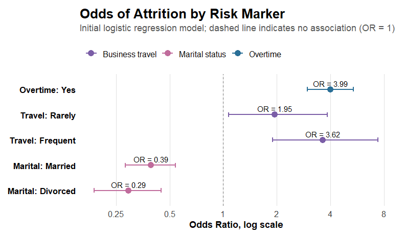
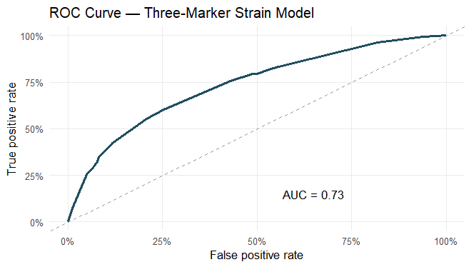

# IBM Employee Attrition — The Cumulative Strain Hypothesis

**Research question:** How does the accumulation of work–life strain
factors (overtime, business travel, and marital status) affect employee
attrition, and can compensation mitigate it?

**Authors:** Tzlil Hayne, Oded Shmuely, Amit Shaimen, Topaz Sarid
(SISE2601)

**Data:** the public IBM HR Analytics Employee Attrition dataset
([Kaggle](https://www.kaggle.com/datasets/pavansubhasht/ibm-hr-analytics-attrition-dataset)).
To reproduce, place `WA_Fn-UseC_-HR-Employee-Attrition.csv` in a `data/`
folder.

# Environment Setup

## Load Libraries

``` r
library(tidyverse)
library(broom)
library(knitr)
library(kableExtra)

navy <- "#1F4E5F"; accent <- "#C0622E"; grayc <- "grey60"
theme_set(theme_minimal(base_size = 11) + theme(panel.grid.minor = element_blank()))
```

## Read Data

``` r
ibm <- read_csv("data/WA_Fn-UseC_-HR-Employee-Attrition.csv", show_col_types = FALSE)
dim(ibm)
```

    ## [1] 1470   35

## Prepare Variables

``` r
# Drop constant / identifier columns, code the target and the strain factors
ibm <- ibm %>%
  select(!c(EmployeeCount, StandardHours, Over18, EmployeeNumber)) %>%
  mutate(
    Attr           = as.integer(Attrition == "Yes"),
    MaritalStatus  = factor(MaritalStatus, levels = c("Single", "Married", "Divorced")),
    BusinessTravel = factor(BusinessTravel,
                            levels = c("Non-Travel", "Travel_Rarely", "Travel_Frequently")),
    s_overtime = as.integer(OverTime == "Yes"),
    s_travel   = as.integer(BusinessTravel != "Non-Travel"),
    s_single   = as.integer(MaritalStatus == "Single"),
    StrainLoad = s_overtime + s_travel + s_single)            # cumulative strain score 0-3
ibm$IncomeBand <- factor(ntile(ibm$MonthlyIncome, 3),
                         labels = c("Low pay", "Medium pay", "High pay"))

base_rate  <- mean(ibm$Attr)                                  # overall attrition rate
strain_tab <- ibm %>% group_by(StrainLoad) %>%                # rates by strain score
  summarise(n = n(), left = sum(Attr), rate = mean(Attr), .groups = "drop")
base_rate
```

    ## [1] 0.1612245

# Data Analysis

# Figure 1 — “Attrition Rate Across Work-Life Strain Markers”

``` r
overall_attrition <- mean(ibm$Attr)

fig1_data <- bind_rows(
  ibm %>%
    group_by(Level = OverTime) %>%
    summarise(
      attrition_rate = mean(Attr),
      n = n(),
      .groups = "drop"
    ) %>%
    mutate(
      Factor = "Overtime",
      Level = recode(
        as.character(Level),
        "No" = "No overtime",
        "Yes" = "Overtime"
      )
    ),

  ibm %>%
    group_by(Level = BusinessTravel) %>%
    summarise(
      attrition_rate = mean(Attr),
      n = n(),
      .groups = "drop"
    ) %>%
    mutate(
      Factor = "Business travel",
      Level = recode(
        as.character(Level),
        "Non-Travel" = "Non-travel",
        "Travel_Rarely" = "Travel rarely",
        "Travel_Frequently" = "Travel frequently"
      )
    ),

  ibm %>%
    group_by(Level = MaritalStatus) %>%
    summarise(
      attrition_rate = mean(Attr),
      n = n(),
      .groups = "drop"
    ) %>%
    mutate(
      Factor = "Marital status",
      Level = as.character(Level)
    )
) %>%
  mutate(
    Factor = factor(
      Factor,
      levels = c("Overtime", "Business travel", "Marital status")
    ),
    Level = factor(
      Level,
      levels = c(
        "No overtime", "Overtime",
        "Non-travel", "Travel rarely", "Travel frequently",
        "Divorced", "Married", "Single"
      )
    ),
    label = paste0(
      scales::percent(attrition_rate, accuracy = 0.1),
      "\n",
      "n=", n
    )
  ) %>%
  group_by(Factor) %>%
  mutate(
    fill_color = case_when(
      Factor == "Overtime" ~ scales::col_numeric(
        palette = c("#D7EAF7", "#2A6F97"),
        domain = range(attrition_rate)
      )(attrition_rate),

      Factor == "Business travel" ~ scales::col_numeric(
        palette = c("#E4D9F2", "#7B5EA7"),
        domain = range(attrition_rate)
      )(attrition_rate),

      Factor == "Marital status" ~ scales::col_numeric(
        palette = c("#F4D9E6", "#C06C9C"),
        domain = range(attrition_rate)
      )(attrition_rate)
    )
  ) %>%
  ungroup()

figure1 <- ggplot(
  fig1_data,
  aes(
    x = Level,
    y = attrition_rate,
    fill = fill_color
  )
) +
  geom_col(
    width = 0.68,
    color = "grey35",
    linewidth = 0.25,
    show.legend = FALSE
  ) +

  geom_text(
    aes(label = label),
    vjust = -0.25,
    size = 3.4,
    color = "black",
    lineheight = 0.90
  ) +

  geom_hline(
    yintercept = overall_attrition,
    linetype = "dashed",
    color = "grey45",
    linewidth = 0.55
  ) +

  facet_grid(
    . ~ Factor,
    scales = "free_x",
    space = "free_x"
  ) +

  scale_y_continuous(
    labels = scales::percent_format(accuracy = 1),
    limits = c(0, 0.36),
    expand = expansion(mult = c(0, 0.08))
  ) +

  scale_fill_identity() +

  labs(
    title = "Attrition Rate Across Work-Life Strain Markers",
    subtitle = paste0(
      "Dashed line = overall attrition rate (",
      scales::percent(overall_attrition, accuracy = 0.1),
      ")"
    ),
    x = NULL,
    y = "Attrition Rate"
  ) +

  theme_minimal(base_size = 12) +
  theme(
    plot.title = element_text(
      size = 17,
      face = "bold",
      color = "black",
      hjust = 0,
      margin = margin(b = 4)
    ),

    plot.subtitle = element_text(
      size = 11.5,
      color = "grey35",
      hjust = 0,
      margin = margin(b = 12)
    ),

    strip.background = element_rect(
      fill = "grey88",
      color = NA
    ),

    strip.text = element_text(
      size = 12,
      face = "bold",
      color = "black",
      margin = margin(t = 6, b = 6)
    ),

    axis.text.x = element_text(
      size = 10.5,
      color = "black",
      angle = 25,
      hjust = 1
    ),

    axis.text.y = element_text(
      size = 10.5,
      color = "grey25"
    ),

    axis.title.y = element_text(
      size = 12,
      face = "bold",
      color = "black"
    ),

    panel.grid.major.x = element_blank(),
    panel.grid.minor = element_blank(),
    panel.grid.major.y = element_line(
      color = "grey88",
      linewidth = 0.35
    ),

    panel.spacing.x = unit(0.45, "lines"),

    plot.margin = margin(10, 16, 8, 10)
  )

dir.create("output/figures", recursive = TRUE, showWarnings = FALSE)

ggsave(
  filename = "output/figures/figure1_attrition_by_key_risk_markers_faceted.png",
  plot = figure1,
  width = 8.2,
  height = 4.6,
  dpi = 350
)

figure1
```

<figure>

<figcaption aria-hidden="true">Figure 1. Attrition rate for each strain
factor. Dashed line = overall average attrition rate
(16.1%).</figcaption>
</figure>

# Figure 2 — Odds ratios from logistic regression

``` r
model_or <- glm(
  Attr ~ OverTime + BusinessTravel + MaritalStatus,
  family = binomial,
  data = ibm
)

or_plot_data <- tidy(
  model_or,
  exponentiate = TRUE,
  conf.int = TRUE
) %>%
  filter(term != "(Intercept)") %>%
  mutate(
    Variable = recode(
      term,
      "OverTimeYes" = "Overtime: Yes",
      "BusinessTravelTravel_Rarely" = "Travel: Rarely",
      "BusinessTravelTravel_Frequently" = "Travel: Frequent",
      "MaritalStatusMarried" = "Marital: Married",
      "MaritalStatusDivorced" = "Marital: Divorced"
    ),
    Factor = case_when(
      str_detect(term, "OverTime") ~ "Overtime",
      str_detect(term, "BusinessTravel") ~ "Business travel",
      str_detect(term, "MaritalStatus") ~ "Marital status"
    ),
    Variable = factor(
      Variable,
      levels = rev(c(
        "Overtime: Yes",
        "Travel: Rarely",
        "Travel: Frequent",
        "Marital: Married",
        "Marital: Divorced"
      ))
    ),
    or_label = paste0("OR = ", sprintf("%.2f", estimate))
  )

figure_or <- ggplot(
  or_plot_data,
  aes(
    x = estimate,
    y = Variable,
    color = Factor
  )
) +
  geom_vline(
    xintercept = 1,
    linetype = "dashed",
    color = "grey45",
    linewidth = 0.6
  ) +
  geom_errorbarh(
    aes(
      xmin = conf.low,
      xmax = conf.high
    ),
    height = 0.18,
    linewidth = 0.9
  ) +
  geom_point(size = 3.3) +
  geom_text(
    aes(label = or_label),
    nudge_y = 0.24,
    size = 3.4,
    color = "black"
  ) +
  scale_x_log10(
    breaks = c(0.25, 0.5, 1, 2, 4, 8),
    labels = c("0.25", "0.5", "1", "2", "4", "8")
  ) +
  scale_color_manual(
    values = c(
      "Overtime" = "#2A6F97",
      "Business travel" = "#7B5EA7",
      "Marital status" = "#C06C9C"
    )
  ) +
  labs(
    title = "Odds of Attrition by Risk Marker",
    subtitle = "Initial logistic regression model; dashed line indicates no association (OR = 1)",
    x = "Odds Ratio, log scale",
    y = NULL,
    color = NULL
  ) +
  theme_minimal(base_size = 12) +
  theme(
    plot.title = element_text(
      size = 17,
      face = "bold",
      color = "black",
      hjust = 0,
      margin = margin(b = 4)
    ),
    plot.subtitle = element_text(
      size = 11.5,
      color = "grey35",
      hjust = 0,
      margin = margin(b = 12)
    ),
    axis.text.y = element_text(
      size = 11,
      color = "black",
      face = "bold"
    ),
    axis.text.x = element_text(
      size = 10.5,
      color = "grey25"
    ),
    axis.title.x = element_text(
      size = 11.5,
      face = "bold",
      color = "black"
    ),
    panel.grid.major.y = element_blank(),
    panel.grid.minor = element_blank(),
    panel.grid.major.x = element_line(
      color = "grey88",
      linewidth = 0.35
    ),
    legend.position = "top",
    legend.justification = "left",
    legend.text = element_text(
      size = 10.5,
      color = "black"
    ),
    plot.margin = margin(10, 16, 8, 10)
  )

dir.create("output/figures", recursive = TRUE, showWarnings = FALSE)

ggsave(
  filename = "output/figures/figure2_logistic_regression_odds_ratios.png",
  plot = figure_or,
  width = 7.2,
  height = 4.2,
  dpi = 350
)

figure_or
```

<figure>

<figcaption aria-hidden="true">Figure 2. Odds ratios from the initial
logistic regression model. Points show odds ratios and lines show 95%
confidence intervals.</figcaption>
</figure>

# Table 1 — Logistic regression odds ratios

``` r
model_or <- glm(
  Attr ~ OverTime + BusinessTravel + MaritalStatus,
  family = binomial,
  data = ibm
)

format_p <- function(p_value) {
  ifelse(p_value < 0.001, "<0.001", sprintf("%.3f", p_value))
}

or_table <- tidy(
  model_or,
  exponentiate = TRUE,
  conf.int = TRUE
) %>%
  filter(term != "(Intercept)") %>%
  transmute(
    Variable = recode(
      term,
      "OverTimeYes" = "Overtime: Yes",
      "BusinessTravelTravel_Rarely" = "Travel: Rarely",
      "BusinessTravelTravel_Frequently" = "Travel: Frequent",
      "MaritalStatusMarried" = "Marital: Married",
      "MaritalStatusDivorced" = "Marital: Divorced"
    ),
    OR = formatC(estimate, format = "f", digits = 2),
    `95% CI` = paste0(
      formatC(conf.low, format = "f", digits = 2),
      "–",
      formatC(conf.high, format = "f", digits = 2)
    ),
    `p-value` = format_p(p.value)
  ) %>%
  mutate(
    row_y = rev(seq(1.35, 4.55, length.out = n())),
    row_id = row_number()
  )

header_data <- tibble(
  label = c("Variable", "OR", "95% CI", "p-value"),
  x = c(0.06, 0.58, 0.75, 0.91),
  hjust = c(0, 0.5, 0.5, 0.5)
)

row_background <- or_table %>%
  mutate(
    fill_color = if_else(row_id %% 2 == 1, "#FFFFFF", "#F6F8FA"),
    ymin = row_y - 0.32,
    ymax = row_y + 0.32
  )

table1_plot <- ggplot() +

  # Title and reference note
  annotate(
    "text",
    x = 0.5,
    y = 6.28,
    label = "Logistic regression odds ratios.",
    size = 4.6,
    fontface = "bold",
    color = "black"
  ) +
  annotate(
    "text",
    x = 0.5,
    y = 5.78,
    label = "Reference groups: no overtime, non-travel, single.",
    size = 3.55,
    fontface = "plain",
    color = "grey25"
  ) +

  # Header background
  geom_rect(
    aes(xmin = 0.02, xmax = 0.98, ymin = 5.05, ymax = 5.45),
    fill = "#E9EEF3",
    color = NA
  ) +

  # Alternating row backgrounds
  geom_rect(
    data = row_background,
    aes(xmin = 0.02, xmax = 0.98, ymin = ymin, ymax = ymax),
    fill = row_background$fill_color,
    color = NA
  ) +

  # Top and bottom rules
  geom_segment(
    aes(x = 0.02, xend = 0.98, y = 5.48, yend = 5.48),
    color = "grey30",
    linewidth = 0.5
  ) +
  geom_segment(
    aes(x = 0.02, xend = 0.98, y = 5.03, yend = 5.03),
    color = "grey55",
    linewidth = 0.35
  ) +
  geom_segment(
    aes(x = 0.02, xend = 0.98, y = 1.00, yend = 1.00),
    color = "grey30",
    linewidth = 0.45
  ) +

  # Header text
  geom_text(
    data = header_data,
    aes(x = x, y = 5.25, label = label, hjust = hjust),
    size = 3.85,
    fontface = "bold",
    color = "black"
  ) +

  # Table body text
  geom_text(
    data = or_table,
    aes(x = 0.06, y = row_y, label = Variable),
    hjust = 0,
    size = 3.75,
    color = "black"
  ) +
  geom_text(
    data = or_table,
    aes(x = 0.58, y = row_y, label = OR),
    hjust = 0.5,
    size = 3.75,
    color = "black"
  ) +
  geom_text(
    data = or_table,
    aes(x = 0.75, y = row_y, label = `95% CI`),
    hjust = 0.5,
    size = 3.75,
    color = "black"
  ) +
  geom_text(
    data = or_table,
    aes(x = 0.91, y = row_y, label = `p-value`),
    hjust = 0.5,
    size = 3.75,
    color = "black"
  ) +

  coord_cartesian(
    xlim = c(0, 1),
    ylim = c(0.75, 6.55),
    clip = "off"
  ) +
  theme_void() +
  theme(
    plot.margin = margin(5, 5, 5, 5)
  )

dir.create("output/figures", recursive = TRUE, showWarnings = FALSE)

ggsave(
  filename = "output/figures/table1_logistic_regression_odds_ratios.png",
  plot = table1_plot,
  width = 6.6,
  height = 2.85,
  dpi = 350
)

table1_plot
```

<!-- -->

\#Attrition Rate by Number of Strain Markers

``` r
library(scales)
strain_tab <- ibm %>% group_by(StrainLoad) %>%
  summarise(n = n(), left = sum(Attr), rate = mean(Attr), .groups = "drop")

ggplot(strain_tab, aes(factor(StrainLoad), rate)) + 
  geom_col(fill = "#7FB3C4", width = 0.45) +
  geom_text(aes(label = paste0(scales::percent(rate, accuracy = 0.1), "\n(n=", n, ")")),
            vjust = -0.3, size = 3, lineheight = 0.9) +
  geom_hline(yintercept = mean(ibm$Attr), linetype = "dashed", colour = "grey60") +
  scale_y_continuous(labels = scales::percent, limits = c(0, 0.6)) +
  labs(x = "Number of strain markers (0-3)", y = "Attrition rate", title = "Attrition Rate by Number of Strain Markers")
```

<!-- -->

# 

``` r
m_load <- glm(Attr ~ StrainLoad, binomial, ibm)
b  <- coef(m_load)["StrainLoad"]
se <- summary(m_load)$coefficients["StrainLoad", "Std. Error"]
ci <- exp(c(b - 1.96*se, b + 1.96*se))                       

trend <- prop.trend.test(strain_tab$left, strain_tab$n)        
m_sep <- glm(Attr ~ s_overtime + s_travel + s_single, binomial, ibm)
lrt   <- anova(m_load, m_sep, test = "LRT")

tibble(
  Statistic = c("OR per additional strain marker",
                "Cochran-Armitage trend test",
                "LRT: separate weights vs. simple count"),
  Result = c(sprintf("%.2f (95%% CI %.2f-%.2f), p < 0.001", exp(b), ci[1], ci[2]),
             sprintf("chi-square = %.1f, p < 0.001", trend$statistic),
             sprintf("p = %.2f (no improvement)", lrt$`Pr(>Chi)`[2]))
) %>% knitr::kable()
```

| Statistic | Result |
|:---|:---|
| OR per additional strain marker | 3.24 (95% CI 2.62-4.01), p \< 0.001 |
| Cochran-Armitage trend test | chi-square = 130.7, p \< 0.001 |
| LRT: separate weights vs. simple count | p = 0.13 (no improvement) |

\#part 3

``` r
attrition_summary <- ibm %>%
  mutate(
    Attr_Num = ifelse(Attrition == "Yes", 1, 0),
    s_overtime = ifelse(OverTime == "Yes", 1, 0),
    s_travel = ifelse(BusinessTravel != "Non-Travel", 1, 0),
    s_single = ifelse(MaritalStatus == "Single", 1, 0),
    StrainLoad = s_overtime + s_travel + s_single,
    
    IncomeBand = ntile(MonthlyIncome, 3),
    PayGroup = case_when(
      IncomeBand == 1 ~ "Low Pay",
      IncomeBand == 2 ~ "Medium Pay",
      IncomeBand == 3 ~ "High Pay"
    )
  ) %>%
  mutate(PayGroup = factor(PayGroup, levels = c("Low Pay", "Medium Pay", "High Pay"))) %>%
  group_by(StrainLoad, PayGroup) %>%
  summarise(
    AttritionRate = mean(Attr_Num),
    n = n(), 
    .groups = "drop"
  ) %>%
  mutate(text_color = ifelse(AttritionRate > 0.30, "white", "black"))

ggplot(attrition_summary, aes(x = PayGroup, y = factor(StrainLoad), fill = AttritionRate)) +
  geom_tile(color = "white", size = 1) +
    geom_text(aes(label = paste0(label_percent(accuracy = 1)(AttritionRate), "\n(n=", n, ")"),
                color = text_color), 
            size = 4, lineheight = 0.9) +
  scale_color_identity() +
  scale_fill_gradient(low = "#F2F0F7", high = "#4A1486", labels = label_percent(accuracy = 1)) +
  labs(
    title = "Attrition Rate by Strain Load and Pay Group",
    subtitle = "Increased compensation cannot fully offset the impact of systemic burnout.",
    x = "Pay Group",
    y = "Strain Load (Number of Factors)",
    fill = "Leaving Rate"
  ) +
  theme_minimal(base_size = 14) +
  theme(
    panel.grid = element_blank(), 
    plot.title = element_text(face = "bold", size = 16),
    plot.subtitle = element_text(color = "grey40", size = 12, margin = margin(b = 15)),
    axis.text = element_text(size = 12)
  )
```

<!-- -->

# correlation income ODS-Ratios

``` r
library(tidyverse)
library(knitr)

data_path <- "data/WA_Fn-UseC_-HR-Employee-Attrition.csv"

ibm <- read_csv(data_path, show_col_types = FALSE) %>%
  select(-EmployeeCount, -StandardHours, -Over18, -EmployeeNumber) %>%
  mutate(
    Attr = if_else(Attrition == "Yes", 1, 0)
  )

m_income <- glm(
  Attr ~ scale(MonthlyIncome),
  data = ibm,
  family = binomial
)

m_income_age <- glm(
  Attr ~ scale(MonthlyIncome) + Age,
  data = ibm,
  family = binomial
)

m_income_seniority <- glm(
  Attr ~ scale(MonthlyIncome) + Age + JobLevel + TotalWorkingYears,
  data = ibm,
  family = binomial
)

extract_income_effect <- function(model, model_name) {
  
  coef_table <- summary(model)$coefficients
  
  estimate <- coef_table["scale(MonthlyIncome)", "Estimate"]
  se <- coef_table["scale(MonthlyIncome)", "Std. Error"]
  p_value <- coef_table["scale(MonthlyIncome)", "Pr(>|z|)"]
  
  or <- exp(estimate)
  ci_low <- exp(estimate - 1.96 * se)
  ci_high <- exp(estimate + 1.96 * se)
  
  tibble(
    Model = model_name,
    `Income OR` = sprintf("%.2f", or),
    `95% CI` = paste0(sprintf("%.2f", ci_low), "–", sprintf("%.2f", ci_high)),
    `p-value` = if_else(
      p_value < 0.001,
      "<0.001",
      sprintf("%.3f", p_value)
    )
  )
}

income_seniority_table <- bind_rows(
  extract_income_effect(m_income, "Income only"),
  extract_income_effect(m_income_age, "Income + Age"),
  extract_income_effect(m_income_seniority, "Income + seniority controls")
)

cat('
<style>
.income-table-title {
  text-align: center;
  color: black;
  font-weight: bold;
  font-size: 11px;
  margin-top: 3px;
  margin-bottom: 4px;
}

.income-table {
  margin-left: auto;
  margin-right: auto;
  border-collapse: collapse;
  width: 46%;
  max-width: 430px;
  font-size: 11px;
  color: black;

.income-table th {
  color: black;
  font-weight: bold;
  text-align: center;
  padding: 5px 8px;
  border-bottom: 2px solid #D9D9D9;
  background-color: white;
}

.income-table td {
  color: black;
  text-align: center;
  padding: 5px 8px;
  border-bottom: 1px solid #E0E0E0;
  background-color: white;
}

.income-table th:first-child,
.income-table td:first-child {
  text-align: left;
  padding-left: 6px;
}

.income-table tr:last-child td {
  border-bottom: none;
}
</style>

<div class="income-table-title">
Income OR after seniority controls
</div>
')
```

<style>
.income-table-title {
  text-align: center;
  color: black;
  font-weight: bold;
  font-size: 11px;
  margin-top: 3px;
  margin-bottom: 4px;
}
&#10;.income-table {
  margin-left: auto;
  margin-right: auto;
  border-collapse: collapse;
  width: 46%;
  max-width: 430px;
  font-size: 11px;
  color: black;
&#10;.income-table th {
  color: black;
  font-weight: bold;
  text-align: center;
  padding: 5px 8px;
  border-bottom: 2px solid #D9D9D9;
  background-color: white;
}
&#10;.income-table td {
  color: black;
  text-align: center;
  padding: 5px 8px;
  border-bottom: 1px solid #E0E0E0;
  background-color: white;
}
&#10;.income-table th:first-child,
.income-table td:first-child {
  text-align: left;
  padding-left: 6px;
}
&#10;.income-table tr:last-child td {
  border-bottom: none;
}
</style>

<div class="income-table-title">

Income OR after seniority controls

</div>

``` r
income_seniority_table_compact <- income_seniority_table %>%
  mutate(
    Model = recode(
      Model,
      "Income only" = "Income only",
      "Income + Age" = "Income + Age",
      "Income + seniority controls" = "Income + seniority controls"
    )
  )

kable(
  income_seniority_table_compact,
  format = "html",
  escape = FALSE,
  align = c("l", "c", "c", "c"),
  table.attr = 'class="income-table"'
)
```

<table class="income-table">

<thead>

<tr>

<th style="text-align:left;">

Model
</th>

<th style="text-align:center;">

Income OR
</th>

<th style="text-align:center;">

95% CI
</th>

<th style="text-align:center;">

p-value
</th>

</tr>

</thead>

<tbody>

<tr>

<td style="text-align:left;">

Income only
</td>

<td style="text-align:center;">

0.55
</td>

<td style="text-align:center;">

0.45–0.67
</td>

<td style="text-align:center;">

\<0.001
</td>

</tr>

<tr>

<td style="text-align:left;">

Income + Age
</td>

<td style="text-align:center;">

0.64
</td>

<td style="text-align:center;">

0.52–0.80
</td>

<td style="text-align:center;">

\<0.001
</td>

</tr>

<tr>

<td style="text-align:left;">

Income + seniority controls
</td>

<td style="text-align:center;">

0.95
</td>

<td style="text-align:center;">

0.57–1.58
</td>

<td style="text-align:center;">

0.843
</td>

</tr>

</tbody>

</table>

# Logistic model with the three strain markers

``` r
m_strain <- glm(Attr ~ OverTime + BusinessTravel + MaritalStatus, binomial, ibm)
ibm$p_hat <- predict(m_strain, type = "response")

# Compute AUC (no extra packages needed)
n1 <- sum(ibm$Attr == 1); n0 <- sum(ibm$Attr == 0)
auc <- (sum(rank(ibm$p_hat)[ibm$Attr == 1]) - n1 * (n1 + 1) / 2) / (n1 * n0)

# ROC curve points across thresholds
thr <- seq(0, 1, by = 0.005)
roc <- data.frame(
  fpr = sapply(thr, function(t) mean(ibm$p_hat[ibm$Attr == 0] >= t)),
  tpr = sapply(thr, function(t) mean(ibm$p_hat[ibm$Attr == 1] >= t)))

ggplot(roc, aes(fpr, tpr)) +
  geom_abline(linetype = "dashed", colour = "grey60") +              # random-guess line (AUC = 0.5)
  geom_line(colour = "#1F4E5F", linewidth = 1) +
  annotate("text", x = 0.65, y = 0.15,
           label = paste0("AUC = ", round(auc, 2))) +
  scale_x_continuous(labels = scales::percent) +
  scale_y_continuous(labels = scales::percent) +
  labs(title = "ROC Curve — Three-Marker Strain Model",
       x = "False positive rate", y = "True positive rate")
```

<!-- -->
