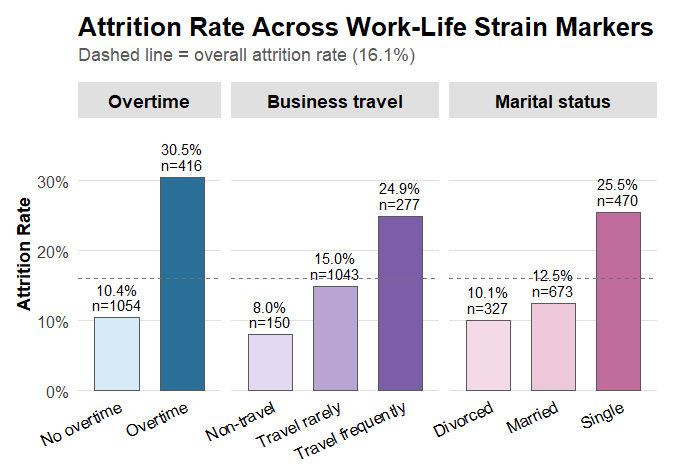
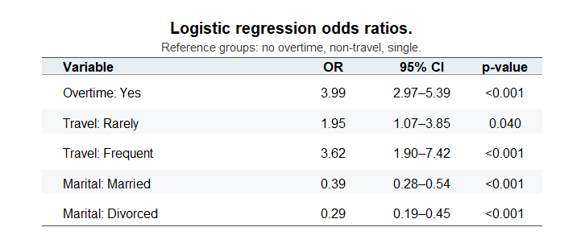
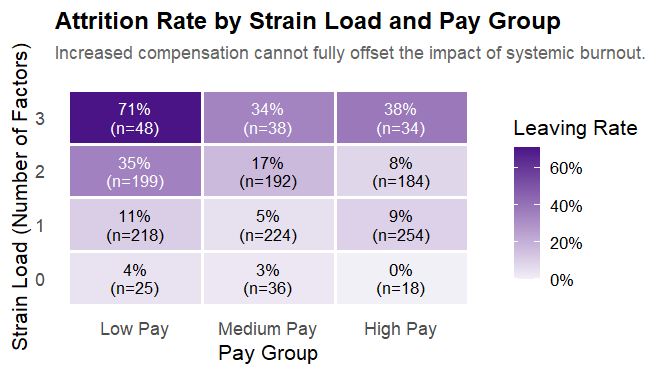

# IBM Employee Attrition — The Cumulative Strain Hypothesis

**Research question:** How does the accumulation of work–life strain
factors (overtime, business travel, and marital status) affect employee
attrition, and can compensation mitigate it?

**Authors:** Tzlil Hayne, Oded Shmuely, Amit Shaimen, Topaz Sarid
(SISE2601)

**Data:** the public IBM HR Analytics Employee Attrition dataset
([Kaggle](https://www.kaggle.com/datasets/pavansubhasht/ibm-hr-analytics-attrition-dataset)).
To reproduce, place `WA_Fn-UseC_-HR-Employee-Attrition.csv` in a `data/`
folder.

# Environment Setup

## Load Libraries

``` r
library(tidyverse)
library(broom)
library(knitr)
library(kableExtra)

navy <- "#1F4E5F"; accent <- "#C0622E"; grayc <- "grey60"
theme_set(theme_minimal(base_size = 11) + theme(panel.grid.minor = element_blank()))
```

## Read Data

``` r
ibm <- read_csv("data/WA_Fn-UseC_-HR-Employee-Attrition.csv", show_col_types = FALSE)
dim(ibm)
```

    ## [1] 1470   35

## Prepare Variables

``` r
# Drop constant / identifier columns, code the target and the strain factors
ibm <- ibm %>%
  select(!c(EmployeeCount, StandardHours, Over18, EmployeeNumber)) %>%
  mutate(
    Attr           = as.integer(Attrition == "Yes"),
    MaritalStatus  = factor(MaritalStatus, levels = c("Single", "Married", "Divorced")),
    BusinessTravel = factor(BusinessTravel,
                            levels = c("Non-Travel", "Travel_Rarely", "Travel_Frequently")),
    s_overtime = as.integer(OverTime == "Yes"),
    s_travel   = as.integer(BusinessTravel != "Non-Travel"),
    s_single   = as.integer(MaritalStatus == "Single"),
    StrainLoad = s_overtime + s_travel + s_single)            # cumulative strain score 0-3
ibm$IncomeBand <- factor(ntile(ibm$MonthlyIncome, 3),
                         labels = c("Low pay", "Medium pay", "High pay"))

base_rate  <- mean(ibm$Attr)                                  # overall attrition rate
strain_tab <- ibm %>% group_by(StrainLoad) %>%                # rates by strain score
  summarise(n = n(), left = sum(Attr), rate = mean(Attr), .groups = "drop")
base_rate
```

    ## [1] 0.1612245

# Data Analysis

# Figure 1 — “Attrition Rate Across Work-Life Strain Markers”

<figure>

<figcaption aria-hidden="true">Figure 1. Attrition rate for each strain
factor. Dashed line = overall average attrition rate
(16.1%).</figcaption>
</figure>

# Table 1 — Logistic regression odds ratios

<!-- -->

\#Attrition Rate by Number of Strain Markers

``` r
library(scales)
strain_tab <- ibm %>% group_by(StrainLoad) %>%
  summarise(n = n(), left = sum(Attr), rate = mean(Attr), .groups = "drop")

ggplot(strain_tab, aes(factor(StrainLoad), rate)) + 
  geom_col(fill = "#7FB3C4", width = 0.45) +
  geom_text(aes(label = paste0(scales::percent(rate, accuracy = 0.1), "\n(n=", n, ")")),
            vjust = -0.3, size = 3, lineheight = 0.9) +
  geom_hline(yintercept = mean(ibm$Attr), linetype = "dashed", colour = "grey60") +
  scale_y_continuous(labels = scales::percent, limits = c(0, 0.6)) +
  labs(x = "Number of strain markers (0-3)", y = "Attrition rate", title = "Attrition Rate by Number of Strain Markers")
```

<!-- -->

# 

| Statistic | Result |
|:---|:---|
| OR per additional strain marker | 3.24 (95% CI 2.62-4.01), p \< 0.001 |
| Cochran-Armitage trend test | chi-square = 130.7, p \< 0.001 |
| LRT: separate weights vs. simple count | p = 0.13 (no improvement) |

\#part 3

``` r
attrition_summary <- ibm %>%
  mutate(
    Attr_Num = ifelse(Attrition == "Yes", 1, 0),
    s_overtime = ifelse(OverTime == "Yes", 1, 0),
    s_travel = ifelse(BusinessTravel != "Non-Travel", 1, 0),
    s_single = ifelse(MaritalStatus == "Single", 1, 0),
    StrainLoad = s_overtime + s_travel + s_single,
    
    IncomeBand = ntile(MonthlyIncome, 3),
    PayGroup = case_when(
      IncomeBand == 1 ~ "Low Pay",
      IncomeBand == 2 ~ "Medium Pay",
      IncomeBand == 3 ~ "High Pay"
    )
  ) %>%
  mutate(PayGroup = factor(PayGroup, levels = c("Low Pay", "Medium Pay", "High Pay"))) %>%
  group_by(StrainLoad, PayGroup) %>%
  summarise(
    AttritionRate = mean(Attr_Num),
    n = n(), 
    .groups = "drop"
  ) %>%
  mutate(text_color = ifelse(AttritionRate > 0.30, "white", "black"))

ggplot(attrition_summary, aes(x = PayGroup, y = factor(StrainLoad), fill = AttritionRate)) +
  geom_tile(color = "white", size = 1) +
    geom_text(aes(label = paste0(label_percent(accuracy = 1)(AttritionRate), "\n(n=", n, ")"),
                color = text_color), 
            size = 4, lineheight = 0.9) +
  scale_color_identity() +
  scale_fill_gradient(low = "#F2F0F7", high = "#4A1486", labels = label_percent(accuracy = 1)) +
  labs(
    title = "Attrition Rate by Strain Load and Pay Group",
    subtitle = "Increased compensation cannot fully offset the impact of systemic burnout.",
    x = "Pay Group",
    y = "Strain Load (Number of Factors)",
    fill = "Leaving Rate"
  ) +
  theme_minimal(base_size = 14) +
  theme(
    panel.grid = element_blank(), 
    plot.title = element_text(face = "bold", size = 16),
    plot.subtitle = element_text(color = "grey40", size = 12, margin = margin(b = 15)),
    axis.text = element_text(size = 12)
  )
```

<!-- -->

\#part 4 \# correlation income ODS-Ratios

<style>
.income-table-title {
  text-align: center;
  color: black;
  font-weight: bold;
  font-size: 11px;
  margin-top: 3px;
  margin-bottom: 4px;
}
&#10;.income-table {
  margin-left: auto;
  margin-right: auto;
  border-collapse: collapse;
  width: 46%;
  max-width: 430px;
  font-size: 11px;
  color: black;
}
&#10;.income-table th {
  color: black;
  font-weight: bold;
  text-align: center;
  padding: 5px 8px;
  border-bottom: 2px solid #D9D9D9;
  background-color: white;
}
&#10;.income-table td {
  color: black;
  text-align: center;
  padding: 5px 8px;
  border-bottom: 1px solid #E0E0E0;
  background-color: white;
}
&#10;.income-table th:first-child,
.income-table td:first-child {
  text-align: left;
  padding-left: 6px;
}
&#10;.income-table tr:last-child td {
  border-bottom: none;
}
</style>

<div class="income-table-title">

Income OR after seniority controls

</div>

<table class="income-table">

<thead>

<tr>

<th style="text-align:left;">

Model
</th>

<th style="text-align:center;">

Income OR
</th>

<th style="text-align:center;">

95% CI
</th>

<th style="text-align:center;">

p-value
</th>

</tr>

</thead>

<tbody>

<tr>

<td style="text-align:left;">

Income only
</td>

<td style="text-align:center;">

0.55
</td>

<td style="text-align:center;">

0.45–0.67
</td>

<td style="text-align:center;">

\<0.001
</td>

</tr>

<tr>

<td style="text-align:left;">

Income + Age
</td>

<td style="text-align:center;">

0.64
</td>

<td style="text-align:center;">

0.52–0.80
</td>

<td style="text-align:center;">

\<0.001
</td>

</tr>

<tr>

<td style="text-align:left;">

Income + seniority controls
</td>

<td style="text-align:center;">

0.95
</td>

<td style="text-align:center;">

0.57–1.58
</td>

<td style="text-align:center;">

0.843
</td>

</tr>

</tbody>

</table>

# Logistic model with the three strain markers

``` r
m_strain <- glm(Attr ~ OverTime + BusinessTravel + MaritalStatus, binomial, ibm)
ibm$p_hat <- predict(m_strain, type = "response")

# Compute AUC (no extra packages needed)
n1 <- sum(ibm$Attr == 1); n0 <- sum(ibm$Attr == 0)
auc <- (sum(rank(ibm$p_hat)[ibm$Attr == 1]) - n1 * (n1 + 1) / 2) / (n1 * n0)

# ROC curve points across thresholds
thr <- seq(0, 1, by = 0.005)
roc <- data.frame(
  fpr = sapply(thr, function(t) mean(ibm$p_hat[ibm$Attr == 0] >= t)),
  tpr = sapply(thr, function(t) mean(ibm$p_hat[ibm$Attr == 1] >= t)))

ggplot(roc, aes(fpr, tpr)) +
  geom_abline(linetype = "dashed", colour = "grey60") +              # random-guess line (AUC = 0.5)
  geom_line(colour = "#1F4E5F", linewidth = 1) +
  annotate("text", x = 0.65, y = 0.15,
           label = paste0("AUC = ", round(auc, 2))) +
  scale_x_continuous(labels = scales::percent) +
  scale_y_continuous(labels = scales::percent) +
  labs(title = "ROC Curve — Three-Marker Strain Model",
       x = "False positive rate", y = "True positive rate")
```

<!-- -->
