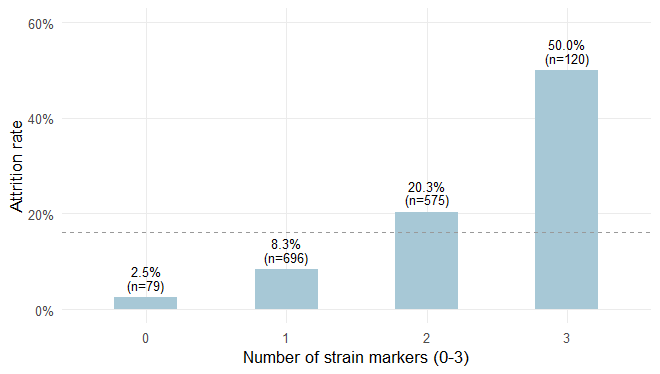

# IBM Employee Attrition — The Cumulative Strain Hypothesis

**Research question:** How does the accumulation of work–life strain
factors (overtime, business travel, and marital status) affect employee
attrition, and can compensation mitigate it?

**Authors:** Tzlil Hayne, Oded Shmuely, Amit Shaimen, Topaz Sarid
(SISE2601)

**Data:** the public IBM HR Analytics Employee Attrition dataset
([Kaggle](https://www.kaggle.com/datasets/pavansubhasht/ibm-hr-analytics-attrition-dataset)).
To reproduce, place `WA_Fn-UseC_-HR-Employee-Attrition.csv` in a `data/`
folder.

# Environment Setup

## Load Libraries

``` r
library(tidyverse)
library(broom)

navy <- "#1F4E5F"; accent <- "#C0622E"; grayc <- "grey60"
theme_set(theme_minimal(base_size = 11) + theme(panel.grid.minor = element_blank()))
```

## Read Data

``` r
ibm <- read_csv("data/WA_Fn-UseC_-HR-Employee-Attrition.csv", show_col_types = FALSE)
dim(ibm)
```

    ## [1] 1470   35

## Prepare Variables

``` r
# Drop constant / identifier columns, code the target and the strain factors
ibm <- ibm %>%
  select(!c(EmployeeCount, StandardHours, Over18, EmployeeNumber)) %>%
  mutate(
    Attr           = as.integer(Attrition == "Yes"),
    MaritalStatus  = factor(MaritalStatus, levels = c("Single", "Married", "Divorced")),
    BusinessTravel = factor(BusinessTravel,
                            levels = c("Non-Travel", "Travel_Rarely", "Travel_Frequently")),
    s_overtime = as.integer(OverTime == "Yes"),
    s_travel   = as.integer(BusinessTravel != "Non-Travel"),
    s_single   = as.integer(MaritalStatus == "Single"),
    StrainLoad = s_overtime + s_travel + s_single)            # cumulative strain score 0-3
ibm$IncomeBand <- factor(ntile(ibm$MonthlyIncome, 3),
                         labels = c("Low pay", "Medium pay", "High pay"))

base_rate  <- mean(ibm$Attr)                                  # overall attrition rate
strain_tab <- ibm %>% group_by(StrainLoad) %>%                # rates by strain score
  summarise(n = n(), left = sum(Attr), rate = mean(Attr), .groups = "drop")
base_rate
```

    ## [1] 0.1612245

# Data Analysis

\#part 2 \#StrainLoad fig

``` r
library(tidyverse)

strain_tab <- ibm %>% group_by(StrainLoad) %>%
  summarise(n = n(), left = sum(Attr), rate = mean(Attr), .groups = "drop")

ggplot(strain_tab, aes(factor(StrainLoad), rate)) +
  geom_col(fill = "#A7C8D6", width = 0.45) +
  geom_text(aes(label = paste0(scales::percent(rate, accuracy = 0.1), "\n(n=", n, ")")),
            vjust = -0.3, size = 3, lineheight = 0.9) +
  geom_hline(yintercept = mean(ibm$Attr), linetype = "dashed", colour = "grey60") +
  scale_y_continuous(labels = scales::percent, limits = c(0, 0.6)) +
  labs(x = "Number of strain markers (0-3)", y = "Attrition rate")
```

<!-- -->

``` r
m_load <- glm(Attr ~ StrainLoad, binomial, ibm)
b  <- coef(m_load)["StrainLoad"]
se <- summary(m_load)$coefficients["StrainLoad", "Std. Error"]
ci <- exp(c(b - 1.96*se, b + 1.96*se))                       

trend <- prop.trend.test(strain_tab$left, strain_tab$n)        
m_sep <- glm(Attr ~ s_overtime + s_travel + s_single, binomial, ibm)
lrt   <- anova(m_load, m_sep, test = "LRT")

tibble(
  Statistic = c("OR per additional strain marker",
                "Cochran-Armitage trend test",
                "LRT: separate weights vs. simple count"),
  Result = c(sprintf("%.2f (95%% CI %.2f-%.2f), p < 0.001", exp(b), ci[1], ci[2]),
             sprintf("chi-square = %.1f, p < 0.001", trend$statistic),
             sprintf("p = %.2f (no improvement)", lrt$`Pr(>Chi)`[2]))
) %>% knitr::kable()
```

| Statistic | Result |
|:---|:---|
| OR per additional strain marker | 3.24 (95% CI 2.62-4.01), p \< 0.001 |
| Cochran-Armitage trend test | chi-square = 130.7, p \< 0.001 |
| LRT: separate weights vs. simple count | p = 0.13 (no improvement) |

\#part 4 \# correlation income ODS-Ratios

<style>
.income-table-title {
  text-align: center;
  color: black;
  font-weight: bold;
  font-size: 11px;
  margin-top: 3px;
  margin-bottom: 4px;
}
&#10;.income-table {
  margin-left: auto;
  margin-right: auto;
  border-collapse: collapse;
  width: 46%;
  max-width: 430px;
  font-size: 11px;
  color: black;
}
&#10;.income-table th {
  color: black;
  font-weight: bold;
  text-align: center;
  padding: 5px 8px;
  border-bottom: 2px solid #D9D9D9;
  background-color: white;
}
&#10;.income-table td {
  color: black;
  text-align: center;
  padding: 5px 8px;
  border-bottom: 1px solid #E0E0E0;
  background-color: white;
}
&#10;.income-table th:first-child,
.income-table td:first-child {
  text-align: left;
  padding-left: 6px;
}
&#10;.income-table tr:last-child td {
  border-bottom: none;
}
</style>

<div class="income-table-title">

Income OR after seniority controls

</div>

<table class="income-table">

<thead>

<tr>

<th style="text-align:left;">

Model
</th>

<th style="text-align:center;">

Income OR
</th>

<th style="text-align:center;">

95% CI
</th>

<th style="text-align:center;">

p-value
</th>

</tr>

</thead>

<tbody>

<tr>

<td style="text-align:left;">

Income only
</td>

<td style="text-align:center;">

0.55
</td>

<td style="text-align:center;">

0.45–0.67
</td>

<td style="text-align:center;">

\<0.001
</td>

</tr>

<tr>

<td style="text-align:left;">

Income + Age
</td>

<td style="text-align:center;">

0.64
</td>

<td style="text-align:center;">

0.52–0.80
</td>

<td style="text-align:center;">

\<0.001
</td>

</tr>

<tr>

<td style="text-align:left;">

Income + seniority controls
</td>

<td style="text-align:center;">

0.95
</td>

<td style="text-align:center;">

0.57–1.58
</td>

<td style="text-align:center;">

0.843
</td>

</tr>

</tbody>

</table>
