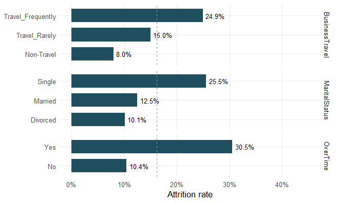
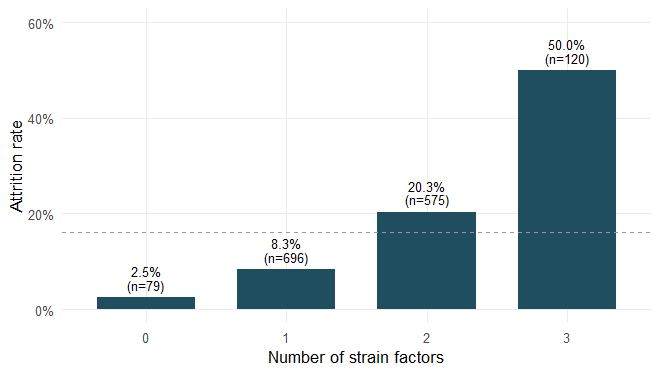
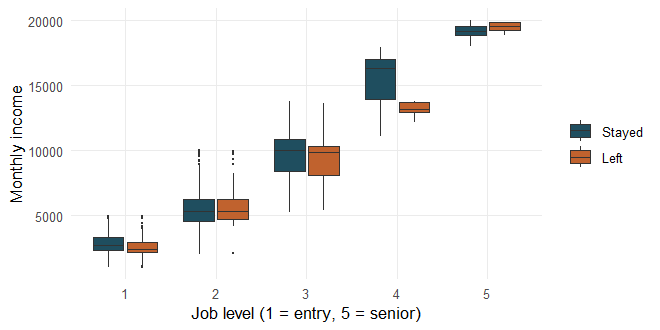
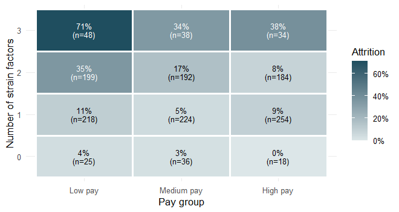
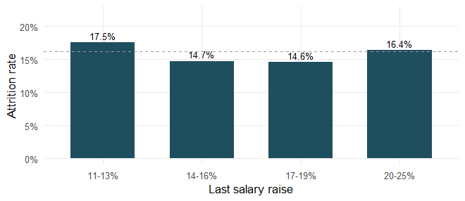
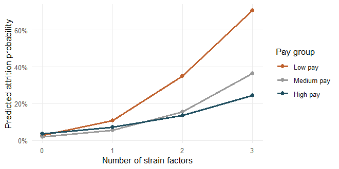
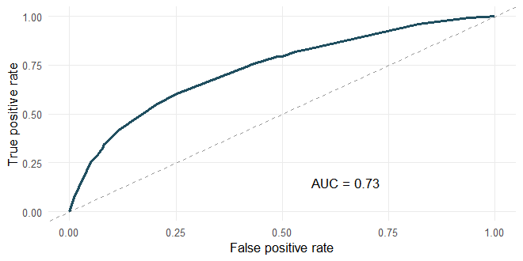

# IBM Employee Attrition — The Cumulative Strain Hypothesis

**Research question:** How does the accumulation of work–life strain
factors (overtime, business travel, and marital status) affect employee
attrition, and can compensation mitigate it?

**Authors:** Tzlil Hayne, Oded Shmuely, Amit Shaimen, Topaz Sarid
(SISE2601)

**Data:** the public IBM HR Analytics Employee Attrition dataset
([Kaggle](https://www.kaggle.com/datasets/pavansubhasht/ibm-hr-analytics-attrition-dataset)).
To reproduce, place `WA_Fn-UseC_-HR-Employee-Attrition.csv` in a `data/`
folder.

# Environment Setup

## Load Libraries

``` r
library(tidyverse)
library(broom)

navy <- "#1F4E5F"; accent <- "#C0622E"; grayc <- "grey60"
theme_set(theme_minimal(base_size = 11) + theme(panel.grid.minor = element_blank()))
```

## Read Data

``` r
ibm <- read_csv("data/WA_Fn-UseC_-HR-Employee-Attrition.csv", show_col_types = FALSE)
dim(ibm)
```

    ## [1] 1470   35

## Prepare Variables

``` r
# Drop constant / identifier columns, code the target and the strain factors
ibm <- ibm %>%
  select(!c(EmployeeCount, StandardHours, Over18, EmployeeNumber)) %>%
  mutate(
    Attr           = as.integer(Attrition == "Yes"),
    MaritalStatus  = factor(MaritalStatus, levels = c("Single", "Married", "Divorced")),
    BusinessTravel = factor(BusinessTravel,
                            levels = c("Non-Travel", "Travel_Rarely", "Travel_Frequently")),
    s_overtime = as.integer(OverTime == "Yes"),
    s_travel   = as.integer(BusinessTravel != "Non-Travel"),
    s_single   = as.integer(MaritalStatus == "Single"),
    StrainLoad = s_overtime + s_travel + s_single)            # cumulative strain score 0-3
ibm$IncomeBand <- factor(ntile(ibm$MonthlyIncome, 3),
                         labels = c("Low pay", "Medium pay", "High pay"))

base_rate  <- mean(ibm$Attr)                                  # overall attrition rate
strain_tab <- ibm %>% group_by(StrainLoad) %>%                # rates by strain score
  summarise(n = n(), left = sum(Attr), rate = mean(Attr), .groups = "drop")
base_rate
```

    ## [1] 0.1612245

# Data Analysis

## Logistic Regression Model

``` r
m_strain <- glm(Attr ~ OverTime + BusinessTravel + MaritalStatus, binomial, ibm)
tidy(m_strain, exponentiate = TRUE, conf.int = TRUE) %>%
  filter(term != "(Intercept)") %>%
  transmute(Variable = term, `Odds Ratio` = round(estimate, 2),
            `CI low` = round(conf.low, 2), `CI high` = round(conf.high, 2),
            `p-value` = signif(p.value, 3)) %>%
  knitr::kable()
```

| Variable                        | Odds Ratio | CI low | CI high |  p-value |
|:--------------------------------|-----------:|-------:|--------:|---------:|
| OverTimeYes                     |       3.99 |   2.97 |    5.39 | 0.000000 |
| BusinessTravelTravel_Rarely     |       1.95 |   1.07 |    3.85 | 0.040000 |
| BusinessTravelTravel_Frequently |       3.62 |   1.90 |    7.42 | 0.000193 |
| MaritalStatusMarried            |       0.39 |   0.28 |    0.54 | 0.000000 |
| MaritalStatusDivorced           |       0.29 |   0.19 |    0.45 | 0.000000 |

## Trend Test and Index Validity

``` r
# Is the rise across strain levels significant? (Cochran-Armitage trend test)
prop.trend.test(strain_tab$left, strain_tab$n)
```

    ## 
    ##  Chi-squared Test for Trend in Proportions
    ## 
    ## data:  strain_tab$left out of strain_tab$n ,
    ##  using scores: 1 2 3 4
    ## X-squared = 130.75, df = 1, p-value < 2.2e-16

``` r
# Odds ratio per extra strain factor
exp(coef(glm(Attr ~ StrainLoad, binomial, ibm)))[2]
```

    ## StrainLoad 
    ##   3.237711

``` r
# Do separate weights beat the simple count? (likelihood-ratio test)
anova(glm(Attr ~ StrainLoad, binomial, ibm),
      glm(Attr ~ s_overtime + s_travel + s_single, binomial, ibm), test = "LRT")
```

    ## Analysis of Deviance Table
    ## 
    ## Model 1: Attr ~ StrainLoad
    ## Model 2: Attr ~ s_overtime + s_travel + s_single
    ##   Resid. Df Resid. Dev Df Deviance Pr(>Chi)
    ## 1      1468     1166.4                     
    ## 2      1466     1162.3  2   4.0642   0.1311

## Confound Check (Overtime vs Single)

``` r
ibm %>% group_by(MaritalStatus) %>% summarise(pct_overtime = mean(OverTime == "Yes"))
```

    ## # A tibble: 3 × 2
    ##   MaritalStatus pct_overtime
    ##   <fct>                <dbl>
    ## 1 Single               0.279
    ## 2 Married              0.276
    ## 3 Divorced             0.303

``` r
chisq.test(table(ibm$MaritalStatus, ibm$OverTime))
```

    ## 
    ##  Pearson's Chi-squared test
    ## 
    ## data:  table(ibm$MaritalStatus, ibm$OverTime)
    ## X-squared = 0.81672, df = 2, p-value = 0.6647

## Income and Seniority (Simpson’s Paradox)

``` r
m1 <- glm(Attr ~ scale(MonthlyIncome), binomial, ibm)
m2 <- glm(Attr ~ scale(MonthlyIncome) + Age, binomial, ibm)
m3 <- glm(Attr ~ scale(MonthlyIncome) + Age + JobLevel + TotalWorkingYears, binomial, ibm)
gor <- function(m) round(exp(coef(m))["scale(MonthlyIncome)"], 2)
gp  <- function(m) round(summary(m)$coefficients["scale(MonthlyIncome)", 4], 3)
tibble(Model = c("Income only", "+ Age", "+ Age, Job level, Tenure"),
       `Income OR` = c(gor(m1), gor(m2), gor(m3)),
       `p-value` = c(gp(m1), gp(m2), gp(m3))) %>%
  knitr::kable()
```

| Model                     | Income OR | p-value |
|:--------------------------|----------:|--------:|
| Income only               |      0.55 |   0.000 |
| \+ Age                    |      0.64 |   0.000 |
| \+ Age, Job level, Tenure |      0.95 |   0.843 |

# Plots

## Attrition by Each Strain Factor

``` r
bind_rows(
  ibm %>% group_by(Level = OverTime) %>% summarise(r = mean(Attr), .groups="drop") %>% mutate(Factor = "OverTime"),
  ibm %>% group_by(Level = MaritalStatus) %>% summarise(r = mean(Attr), .groups="drop") %>% mutate(Factor = "MaritalStatus"),
  ibm %>% group_by(Level = BusinessTravel) %>% summarise(r = mean(Attr), .groups="drop") %>% mutate(Factor = "BusinessTravel")) %>%
  ggplot(aes(reorder(Level, r), r)) +
  geom_col(fill = navy, width = 0.7) +
  geom_text(aes(label = scales::percent(r, accuracy = 0.1)), hjust = -0.15, size = 3) +
  geom_hline(yintercept = base_rate, linetype = "dashed", colour = grayc) +
  coord_flip() + facet_grid(Factor ~ ., scales = "free_y", space = "free_y") +
  scale_y_continuous(labels = scales::percent, limits = c(0, 0.45)) +
  labs(x = NULL, y = "Attrition rate")
```

<!-- -->

## Cumulative Strain Dose-Response

``` r
strain_tab %>% ggplot(aes(factor(StrainLoad), rate)) +
  geom_col(fill = navy, width = 0.7) +
  geom_text(aes(label = paste0(scales::percent(rate, accuracy = 0.1), "\n(n=", n, ")")),
            vjust = -0.3, size = 3, lineheight = 0.9) +
  geom_hline(yintercept = base_rate, linetype = "dashed", colour = grayc) +
  scale_y_continuous(labels = scales::percent, limits = c(0, 0.6)) +
  labs(x = "Number of strain factors", y = "Attrition rate")
```

<!-- -->

## Income by Job Level

``` r
ibm %>% ggplot(aes(factor(JobLevel), MonthlyIncome, fill = factor(Attr))) +
  geom_boxplot(outlier.size = 0.4, linewidth = 0.3) +
  scale_fill_manual(values = c("0" = navy, "1" = accent), labels = c("Stayed", "Left"), name = NULL) +
  labs(x = "Job level (1 = entry, 5 = senior)", y = "Monthly income")
```

<!-- -->

## Strain and Pay Heatmap

``` r
ibm %>% group_by(StrainLoad, IncomeBand) %>%
  summarise(rate = mean(Attr), n = n(), .groups = "drop") %>%
  mutate(txt = ifelse(rate > 0.30, "white", "black")) %>%
  ggplot(aes(IncomeBand, factor(StrainLoad), fill = rate)) +
  geom_tile(colour = "white", linewidth = 1.1) +
  geom_text(aes(label = paste0(scales::percent(rate, accuracy = 1), "\n(n=", n, ")"), colour = txt),
            size = 3, lineheight = 0.9) +
  scale_colour_identity() +
  scale_fill_gradient(low = "#DCE6E8", high = navy, labels = scales::percent) +
  labs(x = "Pay group", y = "Number of strain factors", fill = "Attrition")
```

<!-- -->

## Salary Raises vs Attrition

``` r
ibm %>% mutate(HikeGrp = cut(PercentSalaryHike, c(10,13,16,19,25),
                             labels = c("11-13%","14-16%","17-19%","20-25%"))) %>%
  group_by(HikeGrp) %>% summarise(rate = mean(Attr), .groups = "drop") %>%
  ggplot(aes(HikeGrp, rate)) +
  geom_col(fill = navy, width = 0.65) +
  geom_text(aes(label = scales::percent(rate, accuracy = 0.1)), vjust = -0.4, size = 3) +
  geom_hline(yintercept = base_rate, linetype = "dashed", colour = grayc) +
  scale_y_continuous(labels = scales::percent, limits = c(0, 0.22)) +
  labs(x = "Last salary raise", y = "Attrition rate")
```

<!-- -->

## Predicted Probability by Strain and Pay

``` r
m_int <- glm(Attr ~ StrainLoad * IncomeBand, binomial, ibm)
grid <- expand.grid(StrainLoad = 0:3,
                    IncomeBand = factor(c("Low pay","Medium pay","High pay"),
                                        levels = levels(ibm$IncomeBand)))
grid$p <- predict(m_int, newdata = grid, type = "response")
ggplot(grid, aes(StrainLoad, p, colour = IncomeBand)) +
  geom_line(linewidth = 1) + geom_point(size = 2) +
  scale_y_continuous(labels = scales::percent) +
  scale_colour_manual(values = c("Low pay" = accent, "Medium pay" = grayc, "High pay" = navy)) +
  labs(x = "Number of strain factors", y = "Predicted attrition probability", colour = "Pay group")
```

<!-- -->

## ROC Curve

``` r
ibm$p_hat <- predict(m_strain, type = "response")
n1 <- sum(ibm$Attr == 1); n0 <- sum(ibm$Attr == 0)
auc <- (sum(rank(ibm$p_hat)[ibm$Attr == 1]) - n1*(n1+1)/2) / (n1*n0)
thr <- seq(0, 1, by = 0.005)
data.frame(fpr = sapply(thr, function(t) mean(ibm$p_hat[ibm$Attr == 0] >= t)),
           tpr = sapply(thr, function(t) mean(ibm$p_hat[ibm$Attr == 1] >= t))) %>%
  ggplot(aes(fpr, tpr)) +
  geom_abline(linetype = "dashed", colour = grayc) +
  geom_line(colour = navy, linewidth = 1) +
  annotate("text", x = 0.65, y = 0.15, label = paste0("AUC = ", round(auc, 2))) +
  labs(x = "False positive rate", y = "True positive rate")
```

<!-- -->
